# Materi Docker Untuk Siswa SMK Pemula Dari Nol Sampai Deploy ke Cloudflare

Dokumen ini dibuat khusus untuk siswa SMK yang benar-benar baru mengenal Docker. Bahasa diusahakan sederhana, runtut, dan dekat dengan kehidupan sehari-hari.

Fokus materi ini adalah:

1. Mengenal Docker dari nol
2. Memahami istilah penting di Docker
3. Menjalankan container pertama
4. Memahami Docker Compose
5. Memahami volume, port, dan network
6. Memahami cara publish aplikasi melalui Cloudflare Tunnel

Materi ini cocok dipakai untuk:

1. Bahan ajar kelas
2. Modul belajar mandiri
3. Pendamping presentasi atau demonstrasi langsung

---

# 1. Tujuan Pembelajaran

Setelah mempelajari materi ini, siswa diharapkan mampu:

1. Menjelaskan apa itu Docker dengan bahasa sederhana
2. Menjelaskan perbedaan image, container, volume, port, dan network
3. Menjalankan container sederhana
4. Membaca file `docker-compose.yml`
5. Memahami kenapa satu aplikasi bisa terdiri dari beberapa container
6. Memahami bagaimana aplikasi Docker bisa diakses melalui Cloudflare Tunnel

---

# 2. Sebelum Belajar Docker, Pahami Dulu Masalahnya

Kenapa Docker dibuat?

Karena dalam dunia pemrograman sering terjadi masalah seperti ini:

1. Program jalan di laptop guru, tapi error di laptop siswa
2. Versi PHP di satu komputer berbeda dengan komputer lain
3. Database sudah benar di satu tempat, tapi tidak cocok di tempat lain
4. Saat pindah ke server, aplikasi malah tidak berjalan

Ini terjadi karena setiap komputer punya lingkungan yang berbeda.

Contoh sederhana:

1. Laptop A pakai PHP 8.0
2. Laptop B pakai PHP 8.2
3. Laptop C belum install MySQL
4. Laptop D folder dan konfigurasi server-nya berbeda

Akibatnya, aplikasi yang sama bisa menghasilkan perilaku yang berbeda.

Docker hadir untuk menyelesaikan masalah ini dengan cara membungkus aplikasi dan kebutuhannya ke dalam container.

---

## Ruang Gambar 1

Tempatkan gambar masalah sebelum memakai Docker:

1. Laptop guru sukses
2. Laptop siswa error
3. Server beda konfigurasi

Catatan pengajar:
Tujuan gambar ini adalah membuat siswa paham dulu masalahnya, baru memahami kenapa Docker penting.

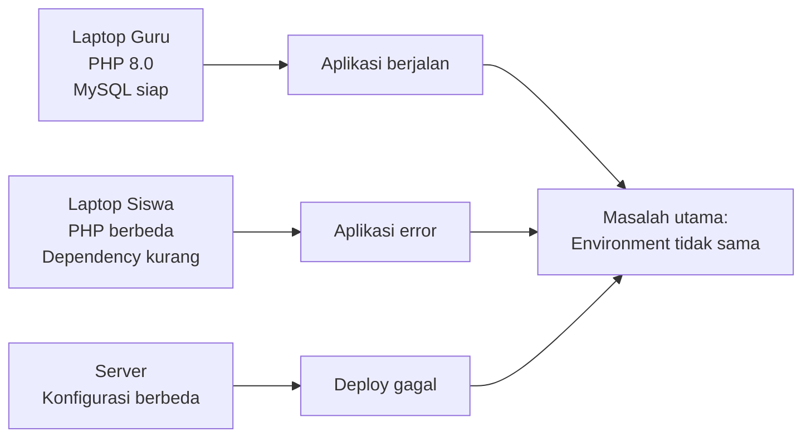

---

# 3. Apa Itu Docker?

Docker adalah platform yang digunakan untuk membuat, menjalankan, dan mengelola aplikasi di dalam container.

Container adalah lingkungan kecil yang terisolasi dan berisi:

1. Aplikasi
2. Dependency
3. Konfigurasi penting
4. Runtime yang dibutuhkan

Artinya, aplikasi tidak hanya dipindahkan sebagai source code, tetapi juga dibawa bersama kebutuhan untuk menjalankannya.

---

# 4. Analogi Sederhana Agar Mudah Dipahami

Bayangkan Anda punya usaha makanan.

1. Makanan adalah aplikasinya
2. Bumbu adalah dependency
3. Kotak makanan adalah container
4. Resep standar adalah image
5. Dapur yang menyiapkan semuanya adalah Docker

Kalau semua makanan dikemas dengan resep dan kotak yang sama, maka hasilnya akan lebih konsisten.

Itulah ide utama Docker: aplikasi berjalan dengan cara yang konsisten di mana pun dijalankan.

---

## Ruang Gambar 2

Tempatkan gambar analogi makanan:

1. Resep = image
2. Kotak makanan = container
3. Isi makanan = aplikasi

Catatan pengajar:
Analogi sederhana sering jauh lebih mudah diingat oleh siswa pemula dibanding definisi teknis.

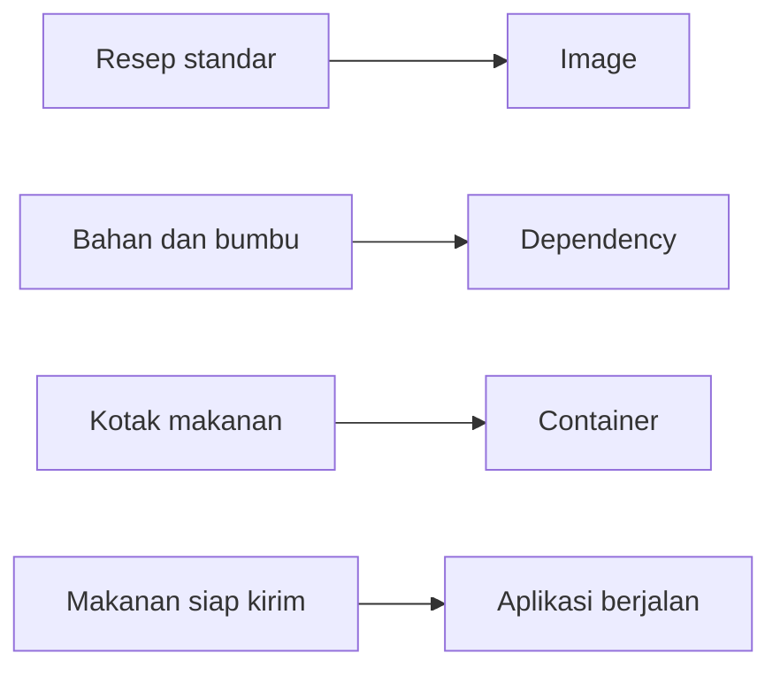

---

# 5. Docker Bukan Virtual Machine

Siswa pemula sering mengira Docker sama dengan Virtual Machine. Keduanya mirip dalam tujuan isolasi, tetapi caranya berbeda.

## Virtual Machine

Virtual Machine biasanya memiliki:

1. Sistem operasi sendiri
2. Kernel sendiri
3. Resource yang lebih berat

## Docker Container

Docker container biasanya:

1. Lebih ringan
2. Lebih cepat dijalankan
3. Berbagi kernel host
4. Fokus pada menjalankan aplikasi

Kesimpulan sederhananya:

1. Virtual Machine seperti membuat satu komputer baru di dalam komputer
2. Docker seperti membuat ruangan kerja khusus untuk aplikasi

---

## Ruang Gambar 3

Tempatkan perbandingan:

1. Host OS + banyak VM
2. Host OS + Docker Engine + banyak container

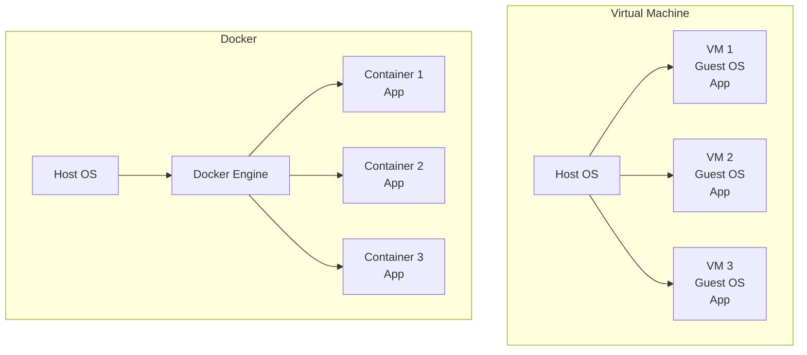

---

# 6. Kenapa Docker Sangat Berguna?

Keunggulan Docker:

1. Lingkungan aplikasi menjadi konsisten
2. Install aplikasi lebih mudah
3. Pindah dari laptop ke server lebih aman
4. Mudah menjalankan banyak service sekaligus
5. Mudah di-backup dan dipindahkan
6. Mudah di-scale jika aplikasi berkembang
7. Mempermudah debugging karena service terpisah
8. Mempermudah deployment modern

## Keunggulan Docker Untuk Strategi Bisnis dan Layanan

Docker juga berguna untuk kebutuhan layanan nyata di perusahaan.

Misalnya ada dua aplikasi:

1. Aplikasi lama yang sudah familiar bagi pengguna lama
2. Aplikasi baru yang lebih modern dan lebih canggih

Tidak semua pengguna ingin pindah cepat ke tampilan baru. Banyak pengguna lama lebih nyaman dengan alur lama, selama fungsi utama masih bisa dipakai dengan mudah.

Dengan Docker, perusahaan dapat menjalankan dua versi aplikasi secara bersamaan.

Contoh manfaatnya:

1. Versi lama tetap aktif untuk pengguna lama
2. Versi baru mulai diperkenalkan untuk pengguna baru
3. Tim tidak perlu mematikan sistem lama secara mendadak
4. Proses transisi lebih aman dan lebih halus
5. Jika versi baru bermasalah, versi lama masih bisa dipakai

Ini adalah salah satu keunggulan besar Docker dalam dunia nyata.

---

## Ruang Gambar 4

Tempatkan gambar dua jalur layanan:

1. Pengguna lama ke aplikasi lama
2. Pengguna baru ke aplikasi baru

Catatan pengajar:
Bagian ini sangat bagus untuk menunjukkan bahwa Docker bukan hanya alat teknis, tetapi juga alat untuk strategi transisi sistem.

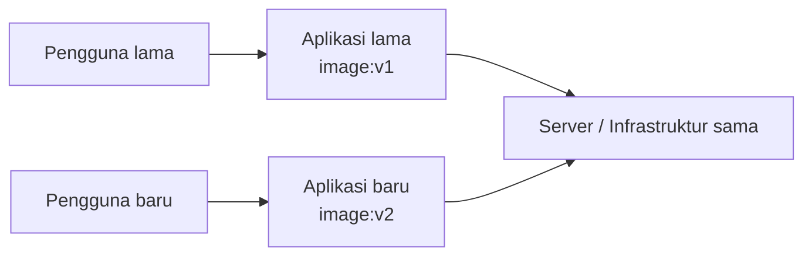

---

# 7. Istilah Penting Dalam Docker

Bagian ini wajib dipahami sebelum praktik.

## 7.1 Docker Engine

Mesin utama yang menjalankan Docker.

## 7.2 Image

Image adalah cetakan atau template aplikasi.

Image berisi:

1. Sistem dasar
2. Dependency
3. File aplikasi
4. Konfigurasi yang dibutuhkan

Contoh image:

1. `nginx:alpine`
2. `mysql:8.0`
3. `postgres:15-alpine`
4. `cloudflare/cloudflared:latest`

## 7.3 Container

Container adalah image yang sedang dijalankan.

Kalau image adalah cetakan, container adalah hasil aktif yang benar-benar hidup.

## 7.4 Registry

Registry adalah tempat menyimpan image.

Contoh:

1. Docker Hub
2. GitHub Container Registry
3. Private Registry

## 7.5 Port

Port adalah pintu akses.

Contoh `8083:80` berarti:

1. Port `8083` di host
2. Diteruskan ke port `80` di container

## 7.6 Volume

Volume adalah tempat menyimpan data agar tidak hilang ketika container dihapus atau dibuat ulang.

## 7.7 Network

Network adalah jalur komunikasi antar-container.

## 7.8 Docker Compose

Docker Compose adalah cara untuk menjalankan banyak container sekaligus dengan satu file konfigurasi.

---

# 8. Hubungan Antar Komponen Docker

Urutan berpikir sederhananya:

1. Kita punya image
2. Image dijalankan menjadi container
3. Container bisa punya volume untuk data
4. Container bisa terhubung ke network
5. Port membuka akses dari host ke container
6. Banyak container bisa diatur bersama dengan Docker Compose

Ilustrasi:

```text
Image -> Container -> Port / Volume / Network
                   -> Dikelola dengan Docker Compose
```

---

## Ruang Gambar 5

Tempatkan diagram hubungan:

1. Image
2. Container
3. Volume
4. Network
5. Port
6. Compose

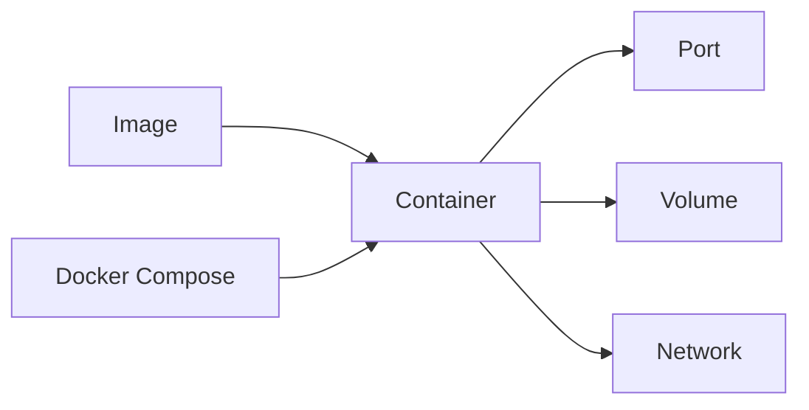

---

# 9. Persiapan Belajar Docker

Untuk praktik, siswa minimal mengenal:

1. Command line dasar
2. Folder dan file
3. Konsep port sederhana
4. Browser dan localhost

Pada Windows, Docker biasanya dijalankan melalui Docker Desktop.

Catatan penting untuk pengajar:

1. Pastikan Docker Desktop sudah aktif
2. Pastikan mode Linux container aktif jika memakai image Linux
3. Pastikan internet tersedia saat menarik image pertama kali

---

# 10. Perintah Dasar Docker

Berikut perintah dasar yang wajib dikenalkan.

```bash
docker ps
docker ps -a
docker images
docker pull nginx:alpine
docker logs -f nama_container
docker exec -it nama_container sh
docker stop nama_container
docker rm nama_container
docker network ls
docker volume ls
```

Penjelasan:

1. `docker ps` melihat container yang sedang berjalan
2. `docker ps -a` melihat semua container termasuk yang berhenti
3. `docker images` melihat image yang tersedia
4. `docker pull` mengambil image dari registry
5. `docker logs` melihat log container
6. `docker exec` masuk ke container
7. `docker stop` menghentikan container
8. `docker rm` menghapus container
9. `docker network ls` melihat network
10. `docker volume ls` melihat volume

---

# 11. Praktik Pertama: Menjalankan Nginx Sederhana

Ini adalah demo paling mudah untuk siswa pemula.

Perintah:

```bash
docker run -d --name web-demo -p 8088:80 nginx:alpine
```

Penjelasan bagian perintah:

1. `docker run` menjalankan container baru
2. `-d` berarti berjalan di background
3. `--name web-demo` memberi nama container
4. `-p 8088:80` membuka port 8088 host ke port 80 container
5. `nginx:alpine` adalah image yang digunakan

Setelah itu buka browser:

```text
http://localhost:8088
```

Jika berhasil, siswa akan melihat halaman default Nginx.

---

## Ruang Gambar 6

Tempatkan screenshot:

1. Perintah `docker run`
2. Hasil `docker ps`
3. Browser menampilkan Nginx

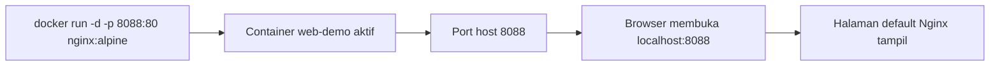

---

# 12. Memahami Port Dengan Mudah

Port bisa dianggap sebagai nomor pintu.

Jika sebuah rumah punya banyak ruangan, maka port membantu kita menentukan ruangan mana yang dituju.

Contoh:

1. Aplikasi A di port 8081
2. Aplikasi B di port 8082
3. Aplikasi C di port 8083

Dengan cara ini, satu server bisa menjalankan banyak aplikasi berbeda.

Contoh dari dokumentasi server Anda:

1. Port 8081 untuk BDN Karanganyar
2. Port 8082 untuk Undangan Pernikahan
3. Port 8083 untuk Portofolio
4. Port 8084 untuk IDN Solo
5. Port 8087 untuk CloudBeaver

---

# 13. Memahami Volume Dengan Mudah

Tanpa volume, data di container bisa hilang ketika container dihapus.

Karena itu volume sangat penting, terutama untuk:

1. Database
2. File upload
3. Folder storage aplikasi

Analogi sederhana:

1. Container adalah kios
2. Volume adalah gudang permanen

Kios bisa dibongkar pasang, tetapi gudang penyimpanan tetap aman.

---

## Ruang Gambar 7

Tempatkan gambar:

1. Container dihapus
2. Data di volume tetap ada

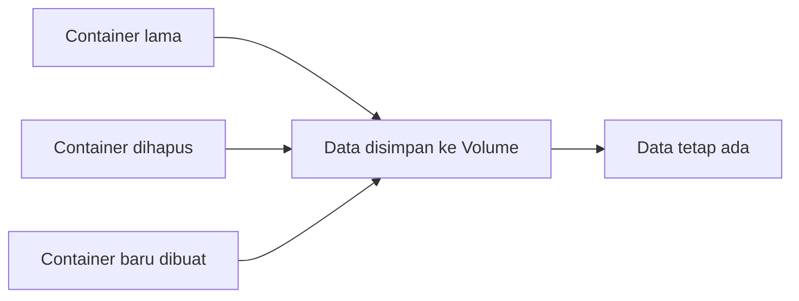

---

# 14. Memahami Network Dengan Mudah

Network pada Docker adalah jalur komunikasi antar-container.

Contoh sederhana dalam satu project:

1. Container web menerima request dari browser
2. Container app memproses logika aplikasi
3. Container database menyimpan data

Container-container ini perlu jalur komunikasi agar bisa saling berbicara.

Ilustrasi:

```text
Browser -> Web -> App -> Database
```

Dalam project nyata, network juga dipakai untuk keamanan.

Misalnya:

1. Database hanya boleh diakses app
2. Container Cloudflare hanya perlu akses ke web
3. Tidak semua service harus saling terhubung

---

# 15. Apa Itu Docker Compose?

Saat aplikasi masih sangat sederhana, kita bisa memakai `docker run`.

Tetapi untuk project sungguhan, biasanya ada lebih dari satu service.

Contohnya:

1. Nginx
2. PHP-FPM atau Node.js
3. MySQL atau PostgreSQL
4. Redis

Kalau semuanya dijalankan manual satu per satu, akan merepotkan.

Karena itu kita memakai Docker Compose.

Docker Compose menggunakan file `docker-compose.yml` untuk mendeskripsikan semua service.

Perintah utama:

```bash
docker compose up -d
docker compose down
docker compose ps
docker compose logs -f
```

---

# 16. Membaca File Docker Compose Paling Sederhana

Contoh:

```yaml
services:
  web:
    image: nginx:alpine
    container_name: web_sederhana
    ports:
      - "8088:80"
    restart: unless-stopped
```

Penjelasan:

1. `services` berisi daftar layanan
2. `web` adalah nama service
3. `image` adalah image yang dipakai
4. `container_name` adalah nama container
5. `ports` adalah jalur akses host ke container
6. `restart` menjaga container tetap aktif

---

## Ruang Gambar 8

Tempatkan screenshot:

1. Isi file `docker-compose.yml`
2. Hasil `docker compose up -d`
3. Hasil `docker compose ps`

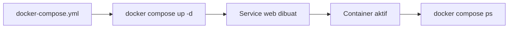

---

# 17. Studi Kasus Project Nyata

Dalam dokumentasi Anda, satu project web bisa terdiri dari beberapa bagian.

Misalnya project Laravel:

1. Container app
2. Container web
3. Container database

Tugas tiap container:

1. Web melayani request dari browser
2. App menjalankan logika program
3. Database menyimpan data

Mengapa dipisah?

1. Lebih rapi
2. Lebih mudah debug
3. Lebih mudah upgrade
4. Lebih aman

---

# 18. Contoh Dari Infrastruktur Yang Sudah Ada

Berdasarkan dokumentasi server Anda, beberapa project memakai pola seperti ini:

1. Project punya network internal sendiri
2. Service web masuk ke `shared_web_network`
3. Cloudflare Tunnel juga masuk ke `shared_web_network`

Artinya, Cloudflare Tunnel cukup berbicara dengan service web, tanpa harus terhubung ke database.

Ini adalah desain yang baik karena:

1. Database lebih aman
2. Routing lebih sederhana
3. Setiap project tetap terisolasi

---

## Ruang Gambar 9

Tempatkan diagram dari arsitektur nyata:

1. Project internal network
2. Shared network
3. Cloudflared
4. Container web

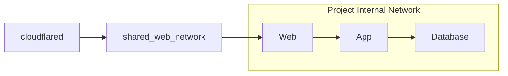

---

# 19. Mengenal Shared Network

`shared_web_network` adalah network bersama yang dipakai agar beberapa project bisa diakses oleh satu Cloudflare Tunnel.

Keuntungannya:

1. Hemat resource
2. Satu tunnel bisa melayani banyak project
3. Lebih mudah dikelola
4. Mudah menambah project baru

Ilustrasi:

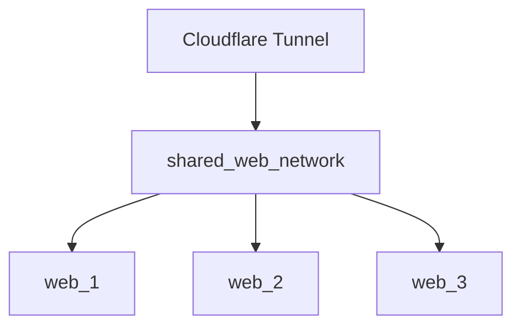

---

# 20. Apa Itu Cloudflare Tunnel?

Cloudflare Tunnel adalah cara untuk mempublikasikan aplikasi ke internet tanpa harus membuka port publik langsung dari server.

Konsepnya sederhana:

1. Server membuat koneksi keluar ke Cloudflare
2. Cloudflare menerima request dari internet
3. Request diteruskan ke service internal yang dituju

Ini sangat berguna untuk:

1. Server rumahan
2. VPS
3. Infrastruktur kecil yang ingin tetap aman

---

# 21. Kenapa Cloudflare Tunnel Cocok Dipadukan Dengan Docker?

Karena Docker memudahkan kita mengatur service, sedangkan Cloudflare memudahkan mempublikasikan service itu ke internet.

Kombinasi ini sangat bagus karena:

1. Service tetap rapi dalam container
2. Network bisa diatur dengan jelas
3. Hanya service web yang perlu diakses publik
4. Database tidak perlu dibuka keluar
5. Satu tunnel bisa melayani banyak project

---

# 22. Alur Request Dari Internet Sampai Ke Container

Ilustrasi sederhananya:

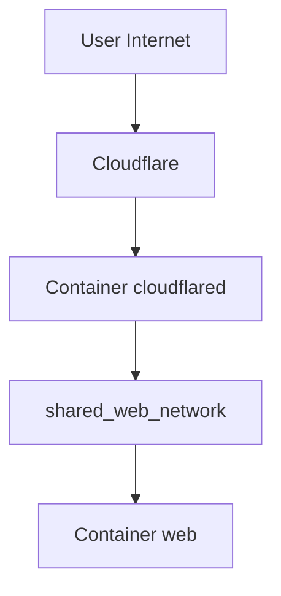

Penjelasan:

1. User membuka domain
2. Domain mengarah ke Cloudflare
3. Cloudflare meneruskan ke container `cloudflared`
4. `cloudflared` meneruskan ke container web melalui `shared_web_network`
5. Container web memberi respon ke user

---

## Ruang Gambar 10

Tempatkan diagram alur request internet ke container.

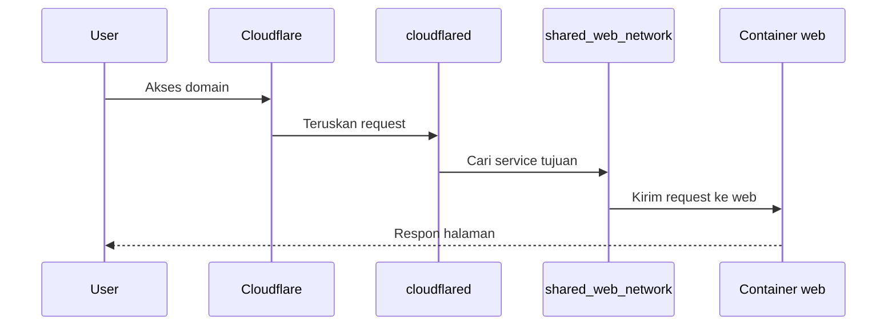

---

# 23. Contoh Compose Web Yang Siap Diakses Tunnel

Contoh sederhana berdasarkan pola yang Anda pakai:

```yaml
services:
  web_portofolio:
    image: ghcr.io/ade99setia/portofolio:latest
    container_name: portofolio_web
    restart: unless-stopped
    ports:
      - "8083:80"
    networks:
      - portfolio_network
      - shared_web_network

networks:
  portfolio_network:
    driver: bridge
  shared_web_network:
    external: true
```

Penjelasan:

1. Service web tetap punya network internal
2. Service web juga masuk `shared_web_network`
3. Karena itulah Cloudflare Tunnel bisa menjangkaunya

---

# 24. Contoh Compose Cloudflare Tunnel

```yaml
services:
  cloudflared:
    image: cloudflare/cloudflared:latest
    container_name: cloudflared_idn_server
    command: tunnel --no-autoupdate run --token ${CLOUDFLARE_TUNNEL_TOKEN} --protocol http2
    networks:
      - shared_web_network
    restart: unless-stopped

networks:
  shared_web_network:
    external: true
```

Yang perlu ditekankan:

1. Token sebaiknya jangan ditulis langsung di file publik
2. Gunakan `.env` atau secret
3. `cloudflared` cukup masuk ke `shared_web_network`

---

# 25. Langkah Deploy Dari Nol Sampai Domain Bisa Diakses

Urutan mudah untuk siswa pahami:

1. Siapkan aplikasi
2. Jalankan container atau Docker Compose
3. Pastikan aplikasi bisa diakses lewat localhost atau IP server
4. Buat `shared_web_network` jika belum ada
5. Hubungkan service web ke network tersebut
6. Jalankan container `cloudflared`
7. Atur public hostname di Cloudflare
8. Uji akses domain

Contoh command:

```bash
docker network create shared_web_network
docker compose up -d
docker ps
docker logs -f cloudflared_idn_server
```

---

## Ruang Gambar 11

Tempatkan screenshot langkah deploy:

1. Buat shared network
2. Jalankan compose
3. Cloudflared aktif
4. Dashboard Cloudflare
5. Domain berhasil dibuka

---

# 26. Praktik Mini Untuk Siswa

## Praktik 1: Menjalankan web sederhana

Tujuan:
Siswa memahami image, container, dan port.

Langkah:

1. Jalankan Nginx
2. Cek `docker ps`
3. Buka browser
4. Hentikan container

## Praktik 2: Menjalankan dengan Docker Compose

Tujuan:
Siswa memahami file Compose dan service.

Langkah:

1. Buat `docker-compose.yml`
2. Jalankan `docker compose up -d`
3. Cek hasilnya
4. Hapus dengan `docker compose down`

## Praktik 3: Diskusi arsitektur

Tujuan:
Siswa memahami kenapa service dipisah.

Pertanyaan:

1. Kenapa web, app, dan database dipisah?
2. Kenapa database tidak langsung diakses internet?
3. Kenapa Cloudflare cukup diarahkan ke web?

---

# 27. Kesalahan Yang Sering Terjadi

## 27.1 Container jalan tetapi web tidak bisa dibuka

Kemungkinan:

1. Port salah
2. Aplikasi di container belum siap
3. Nginx atau service belum benar

## 27.2 Container berhenti sendiri

Kemungkinan:

1. Aplikasi error
2. Command di image salah
3. Environment belum lengkap

## 27.3 Domain Cloudflare tidak tembus

Kemungkinan:

1. Web belum masuk `shared_web_network`
2. Nama target salah di dashboard
3. Tunnel belum aktif

## 27.4 Data database hilang

Kemungkinan:

1. Tidak memakai volume
2. Volume salah pasang

---

# 28. Glosarium Sederhana

Gunakan bagian ini sebagai kamus mini untuk siswa.

1. Docker: platform untuk menjalankan aplikasi dalam container
2. Image: cetakan aplikasi
3. Container: aplikasi yang sedang berjalan
4. Volume: tempat penyimpanan data permanen
5. Network: jalur komunikasi antar-container
6. Port: pintu akses
7. Registry: tempat menyimpan image
8. Compose: alat untuk menjalankan banyak service sekaligus
9. Tunnel: jalur aman dari internet ke service internal

---

# 29. Ringkasan Super Singkat Untuk Siswa

Kalau ingin menjelaskan dalam satu menit, gunakan versi ini:

Docker adalah alat untuk menjalankan aplikasi dalam container. Container membuat aplikasi lebih rapi, konsisten, dan mudah dipindahkan. Di dalam Docker ada istilah image, container, volume, port, dan network. Kalau aplikasinya banyak, kita pakai Docker Compose. Jika aplikasi ingin diakses dari internet dengan aman, kita bisa memakai Cloudflare Tunnel yang menghubungkan domain ke container web.

---

# 30. Pertanyaan Diskusi Untuk Kelas

1. Mengapa Docker mempermudah perpindahan aplikasi dari laptop ke server?
2. Apa bedanya image dan container?
3. Mengapa volume penting?
4. Mengapa port diperlukan?
5. Mengapa database sebaiknya tidak dibuka ke internet?
6. Mengapa Cloudflare Tunnel cukup diarahkan ke container web?
7. Mengapa perusahaan kadang menjalankan versi lama dan versi baru secara bersamaan?
8. Mengapa strategi transisi bertahap lebih aman?

---

# 31. Alur Mengajar Yang Disarankan Untuk Guru

Jika digunakan di kelas, urutannya bisa seperti ini:

1. Mulai dari masalah nyata tanpa Docker
2. Jelaskan konsep Docker dengan analogi sederhana
3. Kenalkan istilah image, container, volume, network, dan port
4. Tunjukkan demo `docker run`
5. Tunjukkan demo `docker compose up -d`
6. Jelaskan arsitektur web, app, database
7. Jelaskan shared network
8. Jelaskan Cloudflare Tunnel
9. Tunjukkan alur domain ke container web
10. Tutup dengan diskusi dan tanya jawab

---

# 32. Penutup

Jika siswa memahami materi ini, maka mereka sudah punya fondasi yang sangat baik untuk masuk ke tahap berikutnya seperti:

1. Build image sendiri
2. Menulis Dockerfile
3. Menjalankan aplikasi multi-service yang lebih kompleks
4. Belajar deployment yang lebih modern

Materi ini sengaja dibuat fokus dari nol sampai publish dengan Cloudflare Tunnel agar siswa melihat alur lengkap dari lingkungan lokal sampai aplikasi dapat diakses publik.

---

# Lampiran Demo Cepat

```bash
docker run -d --name web-demo -p 8088:80 nginx:alpine
docker ps
docker stop web-demo
docker rm web-demo
docker network create shared_web_network
docker compose up -d
docker logs -f cloudflared_idn_server
```

Checklist demo guru:

1. Docker aktif
2. Image berhasil ditarik
3. Container berjalan
4. Browser bisa membuka localhost
5. Shared network tersedia
6. Cloudflared aktif
7. Domain berhasil diakses