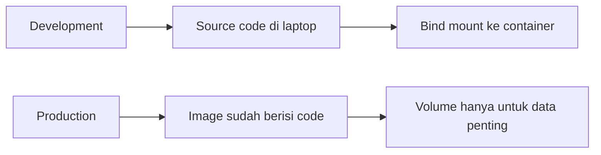
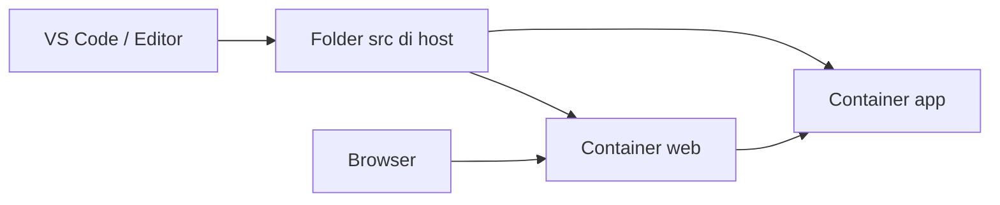
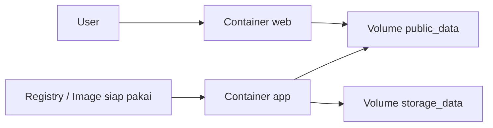
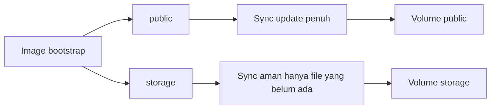
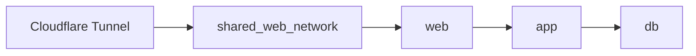

# Materi Teknis Docker: Development vs Production

Dokumen ini adalah lanjutan dari materi Docker dasar. Fokusnya sudah masuk ke teknis konfigurasi file yang paling sering dipakai saat menyiapkan aplikasi web dengan Docker.

Materi ini membahas:

1. `Dockerfile`
2. `.dockerignore`
3. `docker-compose` untuk development
4. `docker-compose` untuk production
5. `default.conf` untuk Nginx
6. Perbedaan strategi mount project di development dan image + volume di production

Contoh file ada di folder [2-docker-learning-examples/php-nginx-dev-prod](2-docker-learning-examples/php-nginx-dev-prod).

---

# 1. Tujuan Pembelajaran Teknis

Setelah mempelajari bagian ini, siswa diharapkan mampu:

1. Menjelaskan fungsi setiap file konfigurasi Docker yang umum dipakai
2. Menjelaskan perbedaan development dan production
3. Membaca `docker-compose` yang memakai bind mount project
4. Membaca `docker-compose` yang memakai image + named volume
5. Memahami kenapa Nginx perlu `default.conf`
6. Memahami kenapa production tidak boleh disamakan dengan development

---

# 2. Gambaran Besar Development vs Production

Secara sederhana:

1. Development dipakai saat kita masih sering mengubah source code
2. Production dipakai saat aplikasi sudah siap dijalankan untuk pengguna

Perbedaan utamanya:

1. Development biasanya mount folder project langsung dari host ke container
2. Production biasanya memakai image yang sudah jadi
3. Production hanya menyimpan data yang memang perlu persisten di volume

Diagram sederhana:



---

# 3. Struktur Folder Contoh

Contoh yang dipakai di materi ini berada di:

[2-docker-learning-examples/php-nginx-dev-prod](2-docker-learning-examples/php-nginx-dev-prod)

Strukturnya:

```text
php-nginx-dev-prod/
├─ .dockerignore
├─ Dockerfile
├─ docker-compose.dev.yml
├─ docker-compose.prod.yml
├─ docker/
│  └─ entrypoint-prod.sh
├─ nginx/
│  └─ default.conf
└─ src/
   ├─ public/
   │  └─ index.php
   └─ storage/
```

Penjelasan singkat:

1. `Dockerfile` untuk membangun image aplikasi
2. `.dockerignore` untuk mengurangi file yang ikut saat build
3. `docker-compose.dev.yml` untuk development
4. `docker-compose.prod.yml` untuk production
5. `default.conf` untuk konfigurasi Nginx
6. `entrypoint-prod.sh` untuk inisialisasi volume production dengan SmartSync

---

# 4. Fungsi Setiap File

## 4.1 Dockerfile

`Dockerfile` dipakai untuk membuat image aplikasi.

Di file contoh [2-docker-learning-examples/php-nginx-dev-prod/Dockerfile](2-docker-learning-examples/php-nginx-dev-prod/Dockerfile), image dibagi menjadi beberapa stage:

1. `base`
2. `development`
3. `production`

Mengapa dibuat seperti ini?

1. Agar satu file bisa dipakai untuk beberapa kebutuhan
2. Development dan production punya tujuan berbeda
3. Build jadi lebih rapi dan lebih hemat pengulangan

Bagian penting yang perlu dijelaskan ke siswa:

1. `FROM` memilih base image
2. `WORKDIR` menentukan direktori kerja
3. `RUN` memasang dependency sistem
4. `COPY` menyalin source code ke image
5. `CMD` menentukan proses utama container
6. `ENTRYPOINT` menjalankan script awal sebelum proses utama

## 4.2 .dockerignore

File [.dockerignore](2-docker-learning-examples/php-nginx-dev-prod/.dockerignore) berfungsi seperti `.gitignore`, tetapi untuk proses build Docker.

Tujuannya:

1. Memperkecil build context
2. Mempercepat proses build
3. Mencegah file tidak penting ikut masuk image
4. Mengurangi risiko file sensitif ikut tercopy

Contoh file yang biasanya diabaikan:

1. `.git`
2. `node_modules`
3. `vendor`
4. file `.env`
5. log dan cache sementara

## 4.3 docker-compose.dev.yml

File [docker-compose.dev.yml](2-docker-learning-examples/php-nginx-dev-prod/docker-compose.dev.yml) dipakai untuk mode development.

Inti idenya:

1. Source code tetap berada di laptop
2. Source code di-mount ke container
3. Saat file diubah, container langsung membaca perubahan terbaru

## 4.4 docker-compose.prod.yml

File [docker-compose.prod.yml](2-docker-learning-examples/php-nginx-dev-prod/docker-compose.prod.yml) dipakai untuk mode production.

Inti idenya:

1. Container app memakai image yang sudah jadi
2. Source code tidak lagi di-bind mount dari laptop atau server
3. Volume hanya dipakai untuk data yang harus persisten

## 4.5 default.conf

File [default.conf](2-docker-learning-examples/php-nginx-dev-prod/nginx/default.conf) adalah konfigurasi Nginx.

Fungsinya:

1. Menentukan root dokumen web
2. Menentukan cara melayani file statis
3. Menentukan cara meneruskan request PHP ke PHP-FPM
4. Membatasi akses ke file sensitif

---

# 5. Konsep Development: Mount Folder Project

Pada development, tujuan utama adalah kemudahan saat coding.

Artinya:

1. Guru atau siswa mengedit file langsung di editor
2. File yang diubah langsung terlihat di container
3. Tidak perlu build image ulang setiap perubahan kecil

Contoh paling penting ada di [docker-compose.dev.yml](2-docker-learning-examples/php-nginx-dev-prod/docker-compose.dev.yml):

```yaml
volumes:
  - ./src:/var/www/html
```

Ini disebut bind mount.

Artinya:

1. Folder `./src` di host dihubungkan langsung ke `/var/www/html` di container
2. Isi folder pada host akan terlihat di container
3. Sangat cocok untuk proses belajar dan pengembangan

Diagram development:



Keuntungan mode development:

1. Cepat untuk testing
2. Cocok untuk belajar
3. Perubahan file langsung terlihat
4. Mudah debug

Kekurangan mode development:

1. Tidak rapi untuk production
2. Bergantung pada folder host
3. Resiko perbedaan environment tetap ada jika tidak disiplin

---

# 6. Konsep Production: Image + Volume Saja

Pada production, tujuan utama bukan kemudahan edit, tetapi kestabilan dan konsistensi.

Karena itu production sebaiknya:

1. Menjalankan image yang sudah jadi
2. Tidak mount source code dari host
3. Hanya memakai volume untuk data yang memang perlu persisten

Contoh di [docker-compose.prod.yml](2-docker-learning-examples/php-nginx-dev-prod/docker-compose.prod.yml):

```yaml
app:
  image: ghcr.io/example/php-nginx-app:latest
  volumes:
    - public_data:/var/www/html/public
    - storage_data:/var/www/html/storage
```

Artinya:

1. Source code aplikasi diasumsikan sudah ada di image
2. Folder `public` dan `storage` disiapkan sebagai named volume
3. Data penting tetap hidup walau container diganti

Diagram production:



Keuntungan mode production:

1. Lebih konsisten
2. Lebih aman
3. Lebih cocok untuk server
4. Mudah rollback ke image sebelumnya

Kekurangan mode production:

1. Setiap perubahan code perlu build image baru
2. Setup awal lebih teknis daripada development

---

# 7. Hal Penting: Volume Bisa Menimpa Isi Image

Ini bagian teknis yang sangat penting.

Banyak orang mengira kalau image sudah punya isi folder `public`, maka saat volume dipasang isinya otomatis tetap terlihat. Padahal tidak selalu begitu.

Saat named volume dipasang ke path tertentu, isi path di image bisa tertutup oleh volume kosong.

Karena itu pada contoh ini ada file [entrypoint-prod.sh](2-docker-learning-examples/php-nginx-dev-prod/docker/entrypoint-prod.sh).

Tugas script ini adalah:

1. Menjalankan `SmartSync` untuk folder `public`
2. Menjalankan `SmartSync` yang aman untuk folder `storage`
3. Menyiapkan isi volume dari image saat container pertama hidup
4. Menjaga deploy berikutnya tetap sinkron tanpa merusak data penting

Diagram masalah volume kosong:


Ini sangat penting untuk dijelaskan karena sesuai dengan pola production yang memakai image + volume saja.

## 7.1 Apa Itu SmartSync Pada Contoh Ini?

Di contoh ini, `SmartSync` berarti sinkronisasi yang dibedakan berdasarkan jenis folder.

### SmartSync untuk `public`

Folder `public` dianggap sebagai bagian dari hasil deploy aplikasi.

Karena itu sinkronisasinya dibuat seperti ini:

1. File dari image disalin ke volume
2. File lama yang sudah tidak ada di image dapat dibersihkan
3. Asset hasil deploy selalu mengikuti versi image terbaru

Secara teknis, script memakai:

```sh
rsync -a --delete /opt/bootstrap/public/ /var/www/html/public/
```

Artinya folder `public` diperlakukan sebagai folder yang dikelola oleh image deploy.

### SmartSync untuk `storage`

Folder `storage` tidak boleh diperlakukan sama seperti `public`, karena bisa berisi data yang perlu dipertahankan.

Karena itu sinkronisasinya dibuat lebih aman:

1. File bawaan dari image hanya ditambahkan jika belum ada
2. File yang sudah ada di volume tidak ditimpa
3. Data yang sudah berjalan di server tetap aman

Secara teknis, script memakai:

```sh
rsync -a --ignore-existing /opt/bootstrap/storage/ /var/www/html/storage/
```

Ini yang disebut `SmartSync`: tiap folder diperlakukan sesuai fungsi aslinya, bukan disalin dengan satu aturan yang sama untuk semua.

Diagram SmartSync:



---

# 8. Membaca Dockerfile Contoh

Bagian penting di [Dockerfile](2-docker-learning-examples/php-nginx-dev-prod/Dockerfile):

```dockerfile
FROM php:8.2-fpm-alpine AS base
WORKDIR /var/www/html
RUN apk add --no-cache bash \
    && docker-php-ext-install pdo pdo_mysql
COPY src/ /var/www/html/
```

Penjelasan:

1. Memakai PHP-FPM Alpine agar image ringan
2. Menentukan direktori kerja aplikasi
3. Menambahkan dependency dasar PHP
4. Menyalin source code ke image

Bagian stage development:

```dockerfile
FROM base AS development
RUN mv "$PHP_INI_DIR/php.ini-development" "$PHP_INI_DIR/php.ini"
CMD ["php-fpm"]
```

Bagian stage production:

```dockerfile
FROM base AS production
RUN mv "$PHP_INI_DIR/php.ini-production" "$PHP_INI_DIR/php.ini"
COPY docker/entrypoint-prod.sh /usr/local/bin/entrypoint-prod.sh
ENTRYPOINT ["entrypoint-prod.sh"]
CMD ["php-fpm"]
```

Pelajaran pentingnya:

1. Development dan production bisa memakai target build berbeda
2. Production bisa punya inisialisasi tambahan sebelum container jalan

---

# 9. Membaca docker-compose.dev.yml

Bagian inti di [docker-compose.dev.yml](2-docker-learning-examples/php-nginx-dev-prod/docker-compose.dev.yml):

```yaml
app:
  build:
    context: .
    dockerfile: Dockerfile
    target: development
  volumes:
    - ./src:/var/www/html
```

Penjelasan:

1. Build memakai target `development`
2. Code lokal di-mount langsung ke container
3. Ini sangat cocok saat masih coding aktif

Service web pada development:

```yaml
web:
  image: nginx:alpine
  volumes:
    - ./nginx/default.conf:/etc/nginx/conf.d/default.conf:ro
    - ./src:/var/www/html:ro
```

Penjelasan:

1. Nginx memakai file `default.conf` lokal
2. Nginx membaca folder project yang sama, tetapi read-only
3. Web meneruskan request PHP ke service `app`

---

# 10. Membaca docker-compose.prod.yml

Bagian inti di [docker-compose.prod.yml](2-docker-learning-examples/php-nginx-dev-prod/docker-compose.prod.yml):

```yaml
app:
  image: ghcr.io/example/php-nginx-app:latest
  volumes:
    - public_data:/var/www/html/public
    - storage_data:/var/www/html/storage
```

Penjelasan:

1. App tidak lagi build dari source lokal
2. App langsung memakai image siap pakai
3. Named volume dipakai untuk folder yang perlu persisten

Bagian web production:

```yaml
web:
  image: nginx:alpine
  volumes:
    - ./nginx/default.conf:/etc/nginx/conf.d/default.conf:ro
    - public_data:/var/www/html/public:ro
```

Penjelasan:

1. Nginx hanya butuh konfigurasi dan folder public
2. Web tidak perlu mount seluruh source code
3. Ini lebih aman dan lebih bersih untuk server production

---

# 11. Membaca default.conf

File [default.conf](2-docker-learning-examples/php-nginx-dev-prod/nginx/default.conf) berisi aturan Nginx.

Bagian pentingnya:

```nginx
root /var/www/html/public;
index index.php index.html;
```

Artinya Nginx akan melayani file dari folder `public`.

Bagian routing:

```nginx
location / {
    try_files $uri $uri/ /index.php?$query_string;
}
```

Ini berguna untuk aplikasi PHP modern yang memakai front controller.

Bagian PHP-FPM:

```nginx
location ~ \.php$ {
    include fastcgi_params;
    fastcgi_pass app:9000;
    fastcgi_param SCRIPT_FILENAME $document_root$fastcgi_script_name;
}
```

Penjelasan:

1. Request file PHP tidak dieksekusi oleh Nginx
2. Request PHP diteruskan ke container `app`
3. `app:9000` berasal dari nama service pada Compose

---

# 12. Development vs Production Dalam Satu Tabel

| Aspek | Development | Production |
| --- | --- | --- |
| Source code | Dari folder host | Sudah ada di image |
| Volume | Biasanya bind mount project | Named volume untuk data |
| Tujuan | Cepat coding dan testing | Stabil, aman, konsisten |
| Build | Bisa sering berubah | Lebih terkontrol |
| Cocok untuk | Laptop developer | Server production |

---

# 13. Hubungan Dengan Infrastruktur Cloudflare

Jika ingin dihubungkan ke Cloudflare Tunnel, biasanya yang masuk ke `shared_web_network` adalah service web.

Contoh produksi:

```yaml
web:
  networks:
    - app_network
    - shared_web_network
```

Mengapa web yang dihubungkan?

1. Karena Cloudflare cukup mengarah ke service web
2. Database tidak perlu dibuka ke luar
3. App tetap berada di jalur internal yang lebih aman

Diagram:



---

# 14. Cara Menjelaskan Ini Ke Siswa

Urutan yang paling mudah dipahami:

1. Tunjukkan dulu folder contoh
2. Jelaskan fungsi setiap file satu per satu
3. Buka mode development, tunjukkan bind mount
4. Buka mode production, tunjukkan image + volume
5. Jelaskan kenapa production tidak mount folder project
6. Jelaskan peran `default.conf` dan `cloudflared`

Kalimat sederhana yang bisa dipakai:

1. Development itu untuk cepat mengubah code
2. Production itu untuk menjalankan aplikasi yang sudah siap pakai
3. Development dekat dengan laptop programmer
4. Production dekat dengan kebutuhan server dan pengguna

---

# 15. Demo Yang Bisa Dilakukan Di Kelas

## Demo development

Masuk ke folder contoh:

```bash
cd 2-docker-learning-examples/php-nginx-dev-prod
docker compose -f docker-compose.dev.yml up -d --build
```

Lalu buka:

```text
http://localhost:8088
```

## Demo production

Untuk production, file Compose ini adalah contoh struktur. Sebelum dijalankan, image `ghcr.io/example/php-nginx-app:latest` perlu diganti dengan image Anda sendiri yang benar-benar tersedia.

Contoh:

```yaml
image: ghcr.io/ade99setia/nama_image_kamu:latest
```

Jika image sudah ada, alurnya:

```bash
docker network create shared_web_network
docker compose -f docker-compose.prod.yml up -d
```

---

# 16. Penutup

Inti dari materi teknis ini adalah memahami bahwa file konfigurasi Docker tidak dibuat asal, tetapi mengikuti tujuan lingkungan.

1. Development fokus pada kemudahan coding
2. Production fokus pada kestabilan dan keamanan
3. `Dockerfile` membangun image
4. `.dockerignore` merapikan build context
5. `docker-compose` mengatur service
6. `default.conf` mengatur jalur Nginx
7. Volume menjaga data tetap ada

Kalau siswa memahami ini, mereka sudah siap masuk ke tahap berikutnya seperti build image sendiri, push ke registry, dan deployment yang lebih rapi.
