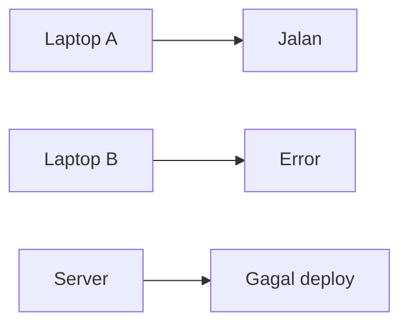
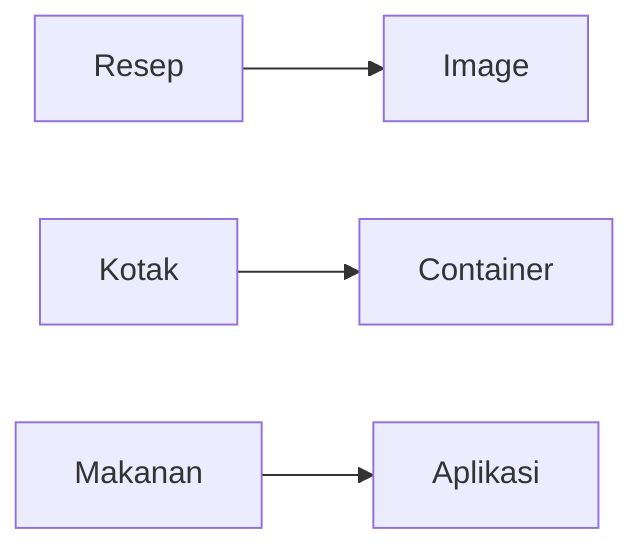
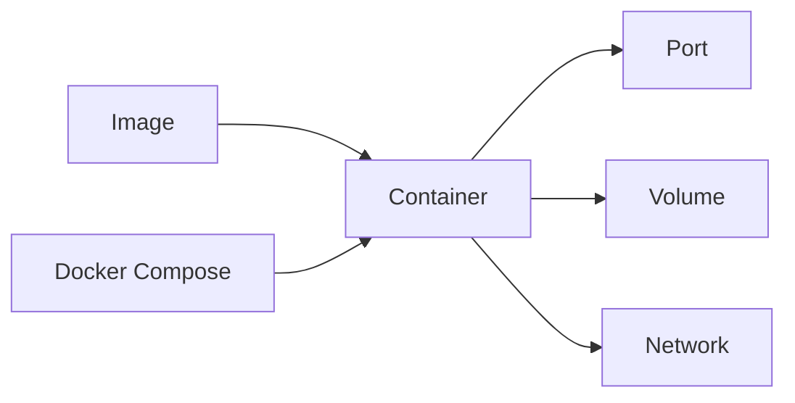
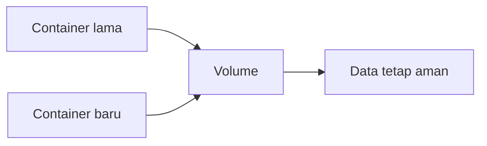
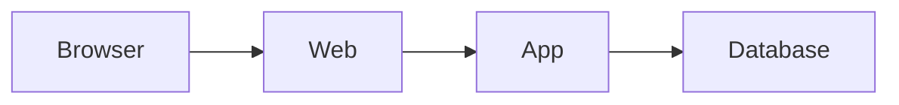
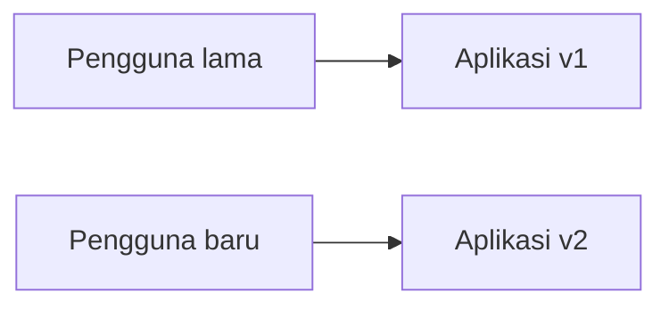
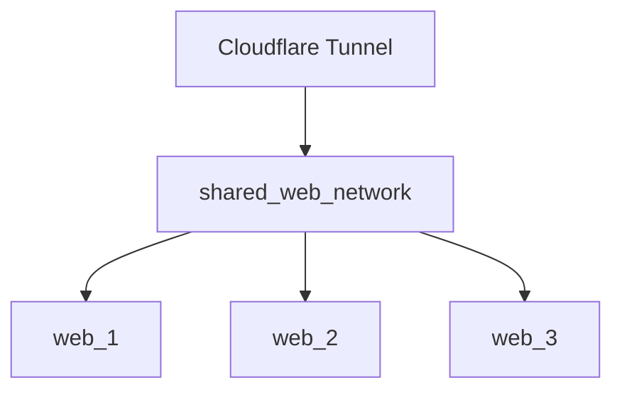
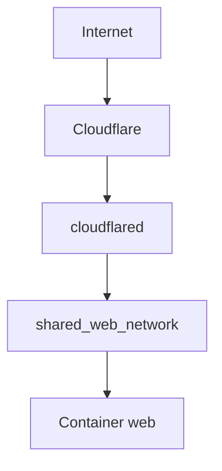

# Slide Guru Docker Pemula

Dokumen ini adalah versi ringkas dari materi lengkap untuk dipakai sebagai alur presentasi guru di kelas. Setiap bagian dibuat singkat agar mudah dijelaskan sambil praktik langsung dan tanya jawab.

---

# Slide 1 - Judul

## Docker Untuk Pemula SMK

Fokus pembelajaran:

1. Apa itu Docker
2. Image, container, volume, port, network
3. Docker Compose
4. Publish ke Cloudflare Tunnel

Catatan guru:
Mulai dari masalah nyata yang sering dialami siswa saat memindahkan aplikasi.

---

# Slide 2 - Masalah Sebelum Docker

Masalah umum:

1. Di laptop A jalan, di laptop B error
2. Versi dependency berbeda
3. Deploy ke server gagal

Kesimpulan:
Masalah utamanya adalah environment tidak sama.



---

# Slide 3 - Apa Itu Docker

Docker adalah alat untuk menjalankan aplikasi di dalam container.

Container berisi:

1. Aplikasi
2. Dependency
3. Konfigurasi

Kalimat sederhana:
Docker membuat aplikasi lebih konsisten saat dijalankan di tempat berbeda.

---

# Slide 4 - Analogi Sederhana

Analogi makanan:

1. Resep = image
2. Kotak makanan = container
3. Isi makanan = aplikasi
4. Dapur = Docker



---

# Slide 5 - Docker vs Virtual Machine

Virtual Machine:

1. Punya OS sendiri
2. Lebih berat

Docker:

1. Lebih ringan
2. Cepat dijalankan
3. Fokus ke aplikasi

Catatan guru:
Gunakan istilah sederhana, jangan terlalu dalam ke kernel kecuali siswa sudah siap.

---

# Slide 6 - Istilah Penting

1. Image = cetakan aplikasi
2. Container = aplikasi yang sedang berjalan
3. Volume = tempat data permanen
4. Port = pintu akses
5. Network = jalur komunikasi
6. Compose = menjalankan banyak service sekaligus

---

# Slide 7 - Hubungan Komponen



Pesan utama:
Satu aplikasi jarang berdiri sendiri. Biasanya ada banyak bagian yang saling terhubung.

---

# Slide 8 - Demo Container Pertama

Command demo:

```bash
docker run -d --name web-demo -p 8088:80 nginx:alpine
```

Lalu cek:

```bash
docker ps
```

Buka browser:

```text
http://localhost:8088
```

---

# Slide 9 - Kenapa Volume Penting

Tanpa volume, data bisa hilang saat container dihapus.

Contoh yang butuh volume:

1. Database
2. File upload
3. Storage aplikasi



---

# Slide 10 - Kenapa Network Penting

Dalam satu aplikasi:

1. Browser ke web
2. Web ke app
3. App ke database



---

# Slide 11 - Apa Itu Docker Compose

Docker Compose dipakai saat project punya banyak service.

Contoh:

1. Web
2. App
3. Database

Command penting:

```bash
docker compose up -d
docker compose down
docker compose ps
```

---

# Slide 12 - Keunggulan Docker Di Dunia Nyata

Docker bisa menjalankan dua versi aplikasi secara bersamaan.

Manfaatnya:

1. Pengguna lama tetap nyaman
2. Pengguna baru bisa pakai versi baru
3. Upgrade bisa bertahap
4. Risiko gangguan lebih kecil



---

# Slide 13 - Shared Network

Konsep penting di infrastruktur Anda:

1. Setiap project punya network internal
2. Service web masuk ke `shared_web_network`
3. Cloudflare Tunnel juga masuk ke `shared_web_network`



---

# Slide 14 - Apa Itu Cloudflare Tunnel

Cloudflare Tunnel mempublikasikan aplikasi ke internet tanpa membuka port publik langsung.

Alur sederhananya:



---

# Slide 15 - Alur Deploy

1. Jalankan aplikasi dengan Docker Compose
2. Pastikan web bisa dibuka lokal
3. Sambungkan web ke `shared_web_network`
4. Jalankan `cloudflared`
5. Atur hostname di Cloudflare
6. Uji domain

Command inti:

```bash
docker network create shared_web_network
docker compose up -d
docker logs -f cloudflared_idn_server
```

---

# Slide 16 - Penutup

Jika siswa paham materi ini, mereka sudah mengerti:

1. Dasar Docker
2. Cara kerja container
3. Konsep multi-service
4. Alur publish aplikasi ke Cloudflare

Catatan guru:
Tutup dengan praktik langsung dan tanya jawab, bukan latihan tertulis.