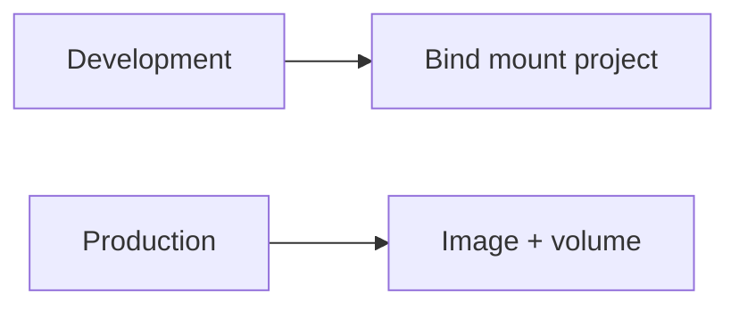
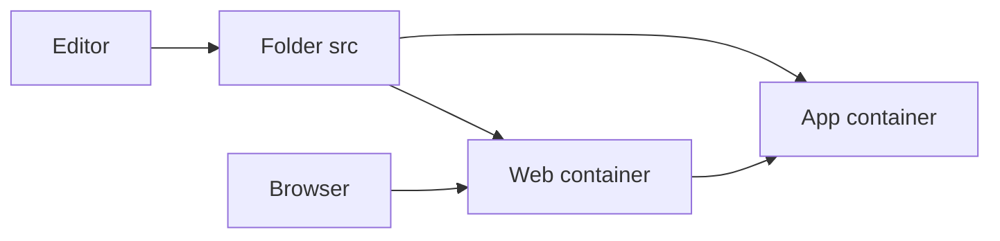
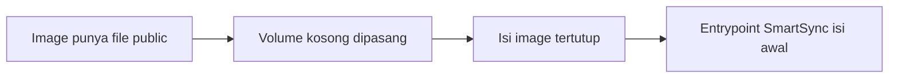
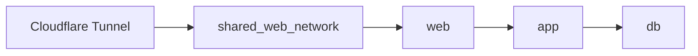

# Slide Guru Docker Teknis: Development vs Production

Dokumen ini adalah versi slide ringkas untuk menjelaskan konfigurasi Docker yang lebih teknis setelah siswa memahami dasar-dasarnya.

---

# Slide 1 - Fokus Materi

Topik hari ini:

1. `Dockerfile`
2. `.dockerignore`
3. `docker-compose.dev.yml`
4. `docker-compose.prod.yml`
5. `default.conf`
6. Development vs Production

---

# Slide 2 - Perbedaan Inti

Development:

1. Source code dari laptop
2. Di-mount langsung ke container
3. Cocok untuk coding dan testing

Production:

1. Source code sudah ada di image
2. Tidak mount project dari host
3. Volume hanya untuk data penting



---

# Slide 3 - Struktur Folder Contoh

Folder contoh:

[2-docker-learning-examples/php-nginx-dev-prod](2-docker-learning-examples/php-nginx-dev-prod)

Isi penting:

1. `Dockerfile`
2. `.dockerignore`
3. `docker-compose.dev.yml`
4. `docker-compose.prod.yml`
5. `nginx/default.conf`
6. `docker/entrypoint-prod.sh` dan SmartSync

---

# Slide 4 - Fungsi Dockerfile

`Dockerfile` dipakai untuk membangun image aplikasi.

Yang dijelaskan ke siswa:

1. `FROM`
2. `WORKDIR`
3. `RUN`
4. `COPY`
5. `CMD`
6. `ENTRYPOINT`

Catatan guru:
Tekankan bahwa image adalah paket siap jalan.

---

# Slide 5 - Fungsi .dockerignore

`.dockerignore` dipakai untuk mengecualikan file yang tidak perlu saat build.

Contoh isi:

1. `.git`
2. `node_modules`
3. `vendor`
4. `.env`

Manfaat:

1. Build lebih cepat
2. Image lebih bersih
3. File sensitif tidak ikut tercopy

---

# Slide 6 - Development Compose

Contoh inti:

```yaml
app:
  build:
    target: development
  volumes:
    - ./src:/var/www/html
```

Pesan utama:

1. File lokal langsung terlihat di container
2. Cocok untuk edit code berulang

---

# Slide 7 - Diagram Development



---

# Slide 8 - Production Compose

Contoh inti:

```yaml
app:
  image: ghcr.io/example/php-nginx-app:latest
  volumes:
    - public_data:/var/www/html/public
    - storage_data:/var/www/html/storage
```

Pesan utama:

1. Tidak mount source code dari host
2. Jalankan image yang sudah jadi
3. Volume hanya untuk data penting

---

# Slide 9 - Kenapa Perlu Entrypoint dan SmartSync

Masalah:

1. Volume kosong bisa menutupi isi folder dari image

Solusi:

1. Pakai `entrypoint-prod.sh`
2. Jalankan `SmartSync` saat container pertama hidup
3. Bedakan cara sync folder `public` dan `storage`



Pesan utama:

1. `public` boleh disinkronkan mengikuti image deploy
2. `storage` harus lebih hati-hati agar data lama tidak hilang

---

# Slide 10 - Fungsi default.conf

`default.conf` dipakai untuk mengatur Nginx.

Perannya:

1. Menentukan root web
2. Menentukan routing
3. Meneruskan PHP ke PHP-FPM

Kunci penting:

```nginx
fastcgi_pass app:9000;
```

Artinya Nginx mengirim request PHP ke service `app`.

---

# Slide 11 - Development vs Production

| Aspek | Development | Production |
| --- | --- | --- |
| Code | Bind mount | Sudah di image |
| Fokus | Cepat ubah code | Stabil dan aman |
| Volume | Minimal | Data penting |
| Cocok untuk | Laptop | Server |

---

# Slide 12 - Hubungan Dengan Cloudflare

Biasanya hanya service `web` yang masuk `shared_web_network`.



Catatan guru:
Tekankan bahwa database tetap sebaiknya berada di jalur internal.

---

# Slide 13 - Demo Kelas

Demo development:

```bash
cd 2-docker-learning-examples/php-nginx-dev-prod
docker compose -f docker-compose.dev.yml up -d --build
```

Demo production:

1. Ganti image contoh ke image yang benar
2. Pastikan `shared_web_network` tersedia
3. Jalankan Compose production

---

# Slide 14 - Penutup

Siswa perlu menangkap 4 ide utama:

1. Development dan production punya tujuan berbeda
2. `Dockerfile` membentuk image
3. `docker-compose` menjalankan banyak service
4. `default.conf` menghubungkan web ke app

Tutup materi dengan buka file satu per satu lalu praktik langsung.